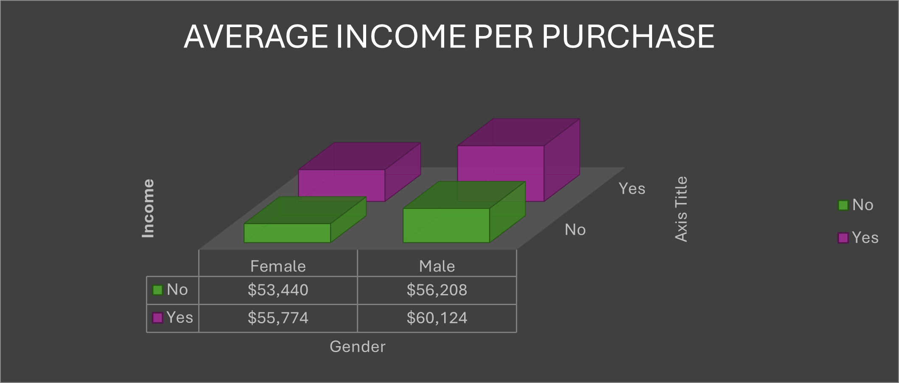
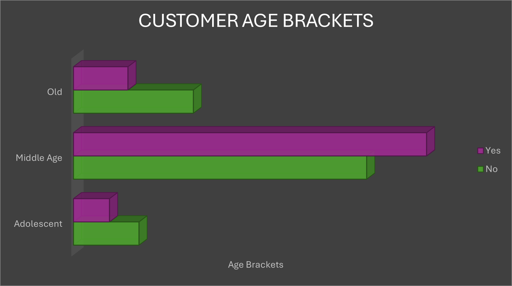
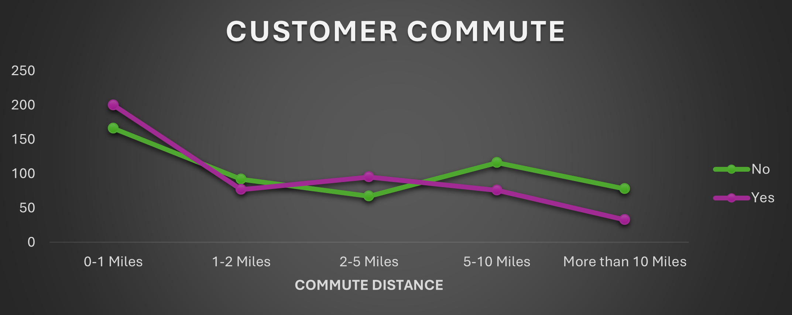
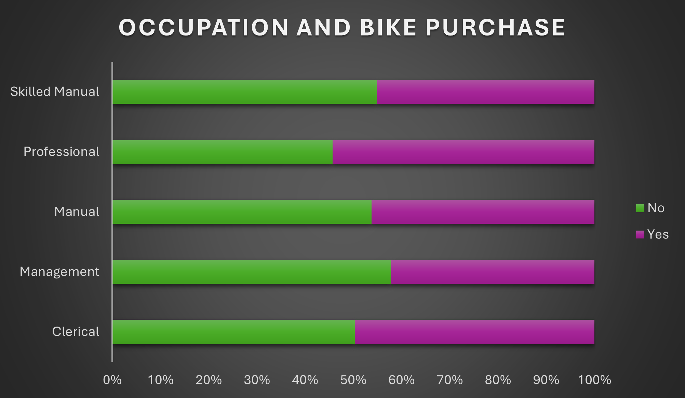
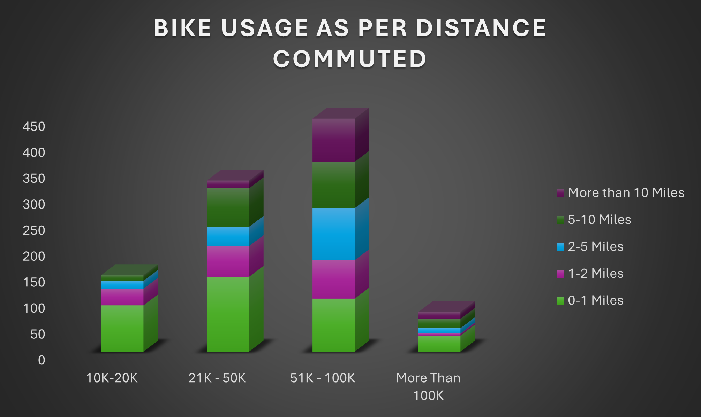
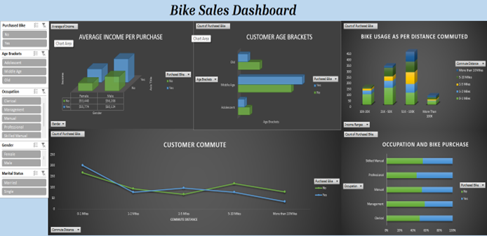

# 🚴‍♂️ Bike Sales Dashboard

## 📄 Overview
This project focuses on creating an interactive dashboard in Excel to analyze customer purchasing patterns for bikes. The goal was to derive actionable insights to improve marketing strategies and better understand customer behavior.

---

## 🔍 Business Problem
Retailers need to identify key customer segments and their preferences to increase bike sales. The analysis answers critical questions, such as:
- Who are the primary buyers (age, gender, income)?
- How does commute distance impact bike usage?
- What occupations show higher purchasing rates?

---

## 📊 Process

### 1️⃣ **Data Preparation**
- Cleaned and structured raw data to remove inconsistencies.
- Applied Excel formulas for data transformation.

### 2️⃣ **Analysis**
- Used Pivot Tables to segment data by demographics, income, and commute distance.
- Created visualizations to track purchase trends.

### 3️⃣ **Visualization**
- Designed an interactive dashboard using Pivot Charts, Slicers, and Conditional Formatting.

---

## 🔑 Key Insights
1. **Income & Gender**: Male customers with a higher income tend to purchase more bikes compared to females, indicating that targeted marketing efforts could be focused on higher-income male demographics

2. **Age Group**: Middle-aged customers dominate bike purchases. This insight could help bike retailers focus their advertising campaigns on this age group

3. **Commute Distance**: Most bike users commute shorter distances (1-5 miles), suggesting bikes are preferred for short commutes. This could influence retailers to promote bikes as an eco-friendly, cost-effective option for short daily commutes

4. **Occupation Trends**: Professional and skilled manual workers show a higher tendency to purchase bikes. Retailers could design special offers or financing plans tailored for these groups

5. **Commute Distance Impact**: The number of bikes purchased decreases as commute distance increases, indicating a potential for retailers to innovate in promoting bikes for longer commutes

---
---

## 🛠️ Skills & Tools Used
- **Tools**: Microsoft Excel
- **Techniques**: Data Cleaning, Pivot Tables, Slicers, Data Visualization, Dashboard Design

---

## 🚀 Future Enhancements
- Integrate external data sources (e.g., weather or location) for deeper insights.
- Automate the dashboard with Excel VBA for real-time updates.
- Expand visualizations to tools like Tableau or Power BI.

---

## 📷 Screenshots
### Dashboard Overview

## 📞 Contact
Feel free to connect with me for feedback or collaboration:
- **[LinkedIn](https://linkedin.com/in/chaitalikhadse)**
- **[GitHub](https://github.com/chaitali-khadse)**

